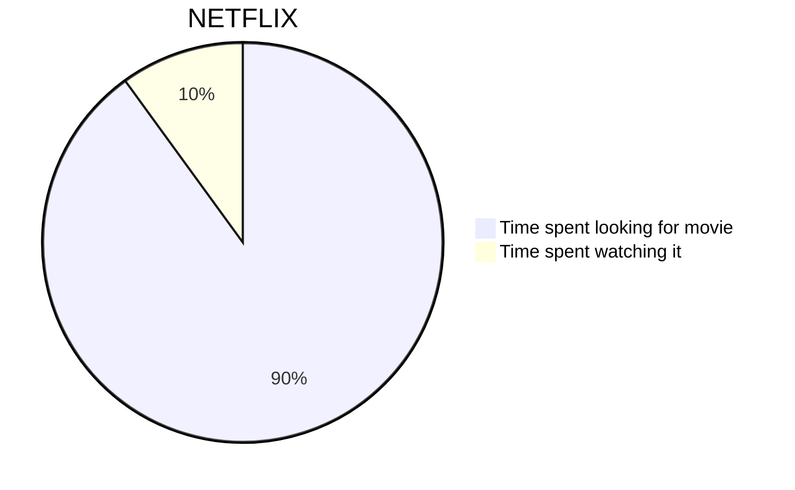

# h1

## h2

### h3

#### h4

##### h5

###### h6

```git
echo "# fish-wood-head.github.io" >> README.md
git init
git add README.md
git commit -m "first commit"
git branch -M main
git remote add origin https://github.com/fish-wood-head/fish-wood-head.github.io.git
git push -u origin main
```

> quote

1. 1

2. 2

3. 3
- 1

- 2

- 3

- [ ] 1

- [x] 2



測試test


